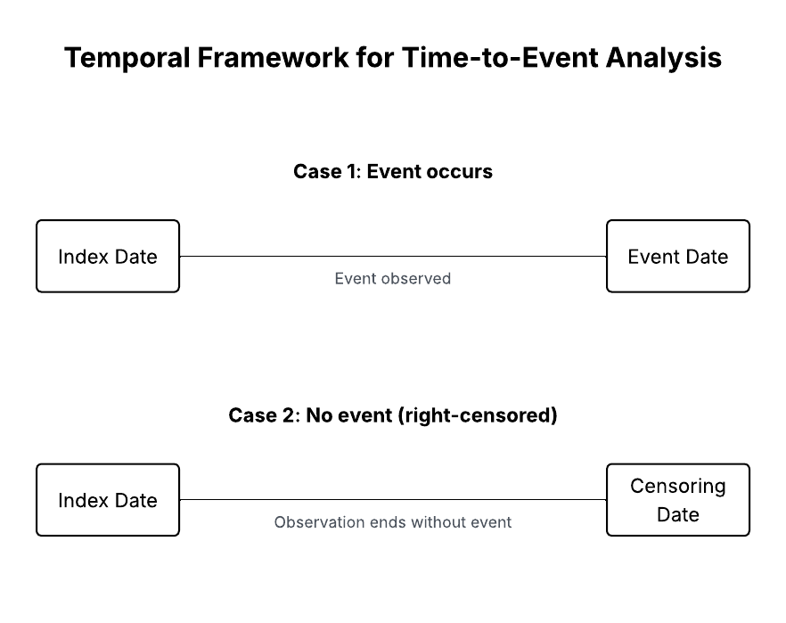

# ckd-risk-modeling-data-pipeline
Clinical data pipeline for CKD risk prediction, focused on cohort construction, outcome validation, and temporal modeling readiness.

# CKD Risk Modeling Data Pipeline

Clinical data pipeline for chronic kidney disease (CKD) risk prediction, focused on cohort construction, outcome validation, and temporal modeling readiness.

## Overview

This was an independent project with a Colombian nephrology clinic. As the sole analyst on the technical work, I extracted data from the clinic's undocumented SQL database (~5M rows across multiple sources), built the cohort construction logic, defined the temporal framework, and produced the methodology and validation documented here. The clinical scope was defined collaboratively with Dr. Carlos Hernán Mejía (nephrologist).

The objective was a patient-level analytical dataset capable of supporting predictive modeling for CKD progression and related outcomes across 1-, 3-, and 5-year horizons.

Rather than fit a model on insufficient or temporally compromised outcome data, the project was deliberately halted at the data architecture stage. The decision prioritized clinical validity over a deliverable — a misleading risk model in a clinical setting causes more harm than no model at all. This repository documents the engineering work and the methodological reasoning behind that decision.

## Methodology Overview

This pipeline summarizes the transformation of raw clinical data into a modeling-ready dataset. 
It includes cohort construction, outcome definition, temporal structuring, and validation steps 
required for time-to-event analysis.

👉 Full methodology available [here](docs/methodology.md)

### Temporal Framework

Each patient’s observation begins at the index date and ends either at the occurrence of the event 
or at the censoring date. This structure enables the calculation of time-to-event variables 
while properly accounting for right-censored observations.

## Key Findings
- A significant proportion of events occurred at the same time as the index date (t = 0), indicating temporal misalignment.
- Several outcomes showed low event frequency, limiting their suitability for predictive modeling.
- Many clinical variables had limited coverage or high missingness.
- Structural data limitations were identified before modeling, preventing unreliable model development.

## Final Dataset
- ~33,000 patients
- 102 variables per patient
- 6 clinical outcomes
- Time-to-event structure defined for each outcome

## Limitations
- Low-frequency outcomes (e.g., cardiovascular mortality, hospitalization)
- Events concentrated at t = 0 (washout issue)
- Variable sparsity across clinical features
- Dependence on proxy definitions for temporal anchors

## Next Steps
- Clinical validation of washout period
- Potential integration of additional data sources
- Redefinition of modelable outcomes
- Transition to predictive modeling once data constraints are resolved

## Privacy & Confidentiality

This repository contains methodology, structural decisions, and abstracted findings only. It does not include raw data, patient records, SQL queries, table schemas, or any information that could identify the source institution. The work was conducted under verbal agreement with the partnering clinic and shared publicly with Dr. Mejía's awareness. All descriptions have been deliberately abstracted to preserve patient privacy and institutional confidentiality.
