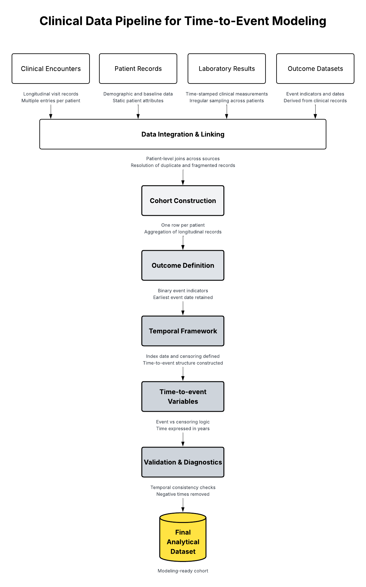

# ckd-risk-modeling-data-pipeline
Clinical data pipeline for CKD risk prediction, focused on cohort construction, outcome validation, and temporal modeling readiness.
# CKD Risk Modeling Data Pipeline

## Overview
This project involved constructing a patient-level analytical dataset for chronic kidney disease risk prediction using real-world clinical data.

The focus was placed on cohort construction, outcome definition, and temporal modeling readiness, rather than premature model development.

The project identified key structural limitations, including data sparsity and temporal inconsistencies, which prevented reliable predictive modeling at this stage.

## Methodology Overview

👉 Full methodology available [here](docs/methodology.md)

## Key Findings
- A significant proportion of events occurred at the same time as the index date (t = 0), indicating temporal misalignment.
- Several outcomes showed low event frequency, limiting their suitability for predictive modeling.
- Many clinical variables had limited coverage or high missingness.
- Structural data limitations were identified before modeling, preventing unreliable model development.

## Final Dataset
- ~33,000 patients
- 102 variables per patient
- 6 clinical outcomes
- Time-to-event structure defined for each outcome

## Limitations
- Low-frequency outcomes (e.g., cardiovascular mortality, hospitalization)
- Events concentrated at t = 0 (washout issue)
- Variable sparsity across clinical features
- Dependence on proxy definitions for temporal anchors

## Next Steps
- Clinical validation of washout period
- Potential integration of additional data sources
- Redefinition of modelable outcomes
- Transition to predictive modeling once data constraints are resolved

## Privacy Notice
This repository does not include raw data, patient records, SQL queries, or proprietary database schemas. All descriptions are abstracted to preserve patient privacy and institutional confidentiality.
